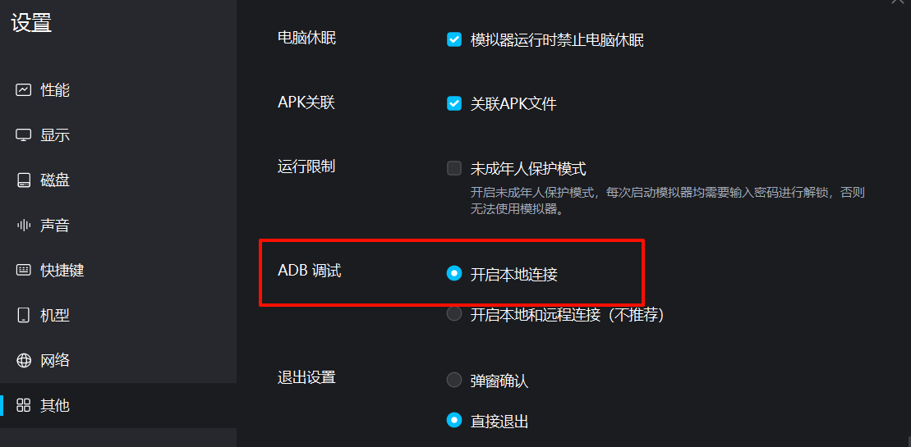

# 问题排查

## 问题自检

如果您在使用 MNMA 时遇到了问题，请先按如下步骤进行自检：

1. 确保**模拟器使用 mumu12**，模拟器**设置开启本地 ADB**，**分辨率比例为 16:9**
2. 确保电脑**没有启用火绒或电脑管家**等防火墙，或已将 MNMA 添加至所有杀毒软件的信任文件中
3. 确保没有其他游戏脚本类软件在操作模拟器
4. **确保 MNMA 为最新版本，或尝试重装最新版 MNMA**
5. 尝试使用**管理员权**限打开 MNMA
6. 关闭 MNMA、模拟器后，在任务管理器中强制结束 `adb.exe` 运行，然后重新尝试。
7. **重启电脑可以解决 99%的问题！**

若以上操作后问题仍未解决，请继续阅读。

## 反馈问题

如果本节后续收录内容没有解决您的问题，您可以在 Github 提交 [issue](https://github.com/kqcoxn/MaaNewMoonAccompanying/issues?q=is%3Aissue)，或在 [QQ 群](http://qm.qq.com/cgi-bin/qm/qr?_wv=1027&k=VMC132QhbMDLi5U62MlDRvtCMj9WOXRr&authKey=yJNKO4sQ%2BBFHpBCLSSEvVOAyz%2FPjknNSl70W3ugg2%2BpELnKmEiHamj1emJMWcLwQ&noverify=0&group_code=993245868) 内礼貌请教群友，但**请确保已经查看过手册对应部分的说明**。

::: tip
本节会持续收录各位组长遇到的问题，所以**您的反馈将会有助于其他组长解决问题**！

在回答其他群友问题时，您可以直接引用本页面连接，方便群友查看。
:::

若是群友没法解决您的问题，您需要做以下准备：

1. 在可能的情况下，复现问题情况，并截图或录制视频
2. 运行 MNMA 根目录下 `反馈打包小工具.exe`
3. 将打包好的 `反馈日志.zip` 同视频与截图发送至群内，并描述问题情况
4. 若群友无法帮忙解决，在群内@群主或私聊群主

## 下载安装类

### Github 页面打不开/下载缓慢

国内对于 Github 的防火墙时有时无，且速度非常不稳定。如果条件允许，请使用网络代理或加速器访问。

如果您无法通过其他途径进入 Github 页面，或下载速度被限制，可以在 [QQ 群](http://qm.qq.com/cgi-bin/qm/qr?_wv=1027&k=VMC132QhbMDLi5U62MlDRvtCMj9WOXRr&authKey=yJNKO4sQ%2BBFHpBCLSSEvVOAyz%2FPjknNSl70W3ugg2%2BpELnKmEiHamj1emJMWcLwQ&noverify=0&group_code=993245868) **群文件**内获取您需要的资源，包括 MNMA 压缩包、更新包等。

或者，您可以使用 [Mirror 酱](../users/install.md#mirror-酱支持) 作为国内镜像源下载。（需要自备 CDK）

### 更新失败/速度缓慢

MNMA 的默认下载源为 Github。国内对于 Github 的防火墙时有时无，且速度非常不稳定。如果条件允许，请在网络代理或加速器环境下更新。

或者，您可以在设置页面切换 [Mirror 酱](../users/install.md#mirror-酱支持) 作为国内镜像源更新。（需要自备 CDK）

如果您不希望通过其他途径更新，您可以在[QQ 群](http://qm.qq.com/cgi-bin/qm/qr?_wv=1027&k=VMC132QhbMDLi5U62MlDRvtCMj9WOXRr&authKey=yJNKO4sQ%2BBFHpBCLSSEvVOAyz%2FPjknNSl70W3ugg2%2BpELnKmEiHamj1emJMWcLwQ&noverify=0&group_code=993245868) **群文件**内下载最新版本的 MNMA 压缩包并重新安装。

如果您希望保留配置，可以将旧版本的`/config`文件夹覆盖至新版本。

### 获取最新版本信息失败

若描述为 CDK 无效，请在设置内将下载源调整为 Github，或关闭自动检查/更新。

也可以输入 mirrorc CDK，详情参考 [Mirror 酱支持](./install.md#mirror-酱支持)

## 程序运行类

### SSL Error

尝试关闭代理/梯子，并重启 MNMA

::: tip
此问题并非由于 MNMA 导致，出现了此提示代表您可能使用了未配置安全凭证的梯子，或代理通道识别异常。
:::

### Agent 加载失败

基本是 Python 环境的问题。

Python 包的默认下载源是国内，如果您配置了代理或加速器，可能是由于被拦截导致的，请关闭 MNMA 后关闭代理或加速器，再重新启动 MNMA 尝试。

如果仍然无法解决，请进群询问。

### 模拟器连接失败

请先确保您的模拟器正常启动，得先开着模拟器才能连接到模拟器。

如果模拟器已经启动，请检查模拟器是否已经开启本地 ADB：



如果您的模拟器没有此选项，请在 mumu12 官网重新下载最新版模拟器。

### 缺少 xxx.dll/运行库

对于 Windows/MacOS 用户，需要在运行前安装运行库。

MNMA 需要 `VCRedist x64` (`Cli` 与 `Gui` 都需要) 和 `.NET 8` (使用 `GUI` 时需要)。

点击 [vc_redist.x64](https://download.visualstudio.microsoft.com/download/pr/285b28c7-3cf9-47fb-9be8-01cf5323a8df/8F9FB1B3CFE6E5092CF1225ECD6659DAB7CE50B8BF935CB79BFEDE1F3C895240/VC_redist.x64.exe) 下载安装 `VCRedist x64`，点击 [dotnet-sdk-8.0.5-win-x64.exe](https://download.visualstudio.microsoft.com/download/pr/ba3a1364-27d8-472e-a33b-5ce0937728aa/6f9495e5a587406c85af6f93b1c89295/dotnet-sdk-8.0.404-win-x64.exe) 下载安装 `.NET 8`。

若您已经存在运行库，请尝试选择修改/重装。

也可以右键开始按钮打开终端，在终端内粘贴以下命令回车以进行安装：

```shell
winget install Microsoft.VCRedist.2017.x64 Microsoft.DotNet.DesktopRuntime.8
```

在安装时，依次点下一步即可，建议不要随意更改环境运行库的安装路径。

### 目标计算机积极拒绝

情况很多，在群里问吧（
