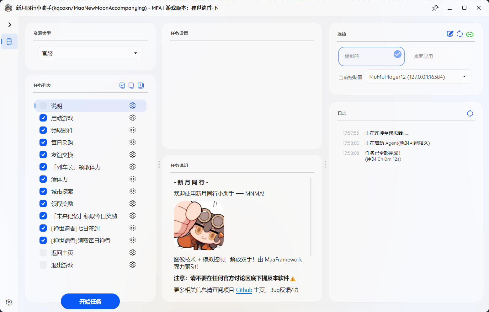

# 功能说明

## 客户端（GUI）操作

客户端的 GUI 如下图所示：

其中，客户端首页为任务配置面板：

- **资源类型**：目前仅适配官服，B 服大多数功能可用，若有问题请 [反馈问题](../users/errors.md#反馈问题)
- **任务列表**：在点击开始任务后，MNMA 会依次执行勾选的任务。
  - 左键点击选择框可以切换是否执行该任务，右键点击选择框为仅执行一次此任务后自动取消勾选
  - 您可以点击任务列表右上角的快捷按钮进行全选、清空、添加任务功能。（**MNMA 版本更新后，新增的任务需要手动添加**，任务可重复添加，在列表内留下多个任务）
  - 您可以拖动列表中的任务进行执行顺序排序
  - 您可以右键已在列表的任务，并在点击删除后从列表中移除
  - 点击任务右侧的齿轮，您可以在任务设置面板中调整任务参数
- **任务设置**：不同任务有不同的配置项，您可以结合自身需要进行选择，相关说明在任务说明面板
- **任务说明**：任务说明面板中包含任务说明、任务参数说明、注意事项等
- **连接**：您的模拟器信息，若开启多个模拟器请手动配置对应的控制器
- **日志**：MNMA 的日志信息，若出现错误，请查看日志信息

点击左下角的齿轮，您可以进入 GUI 的设置界面，对 MNMA 本身进行配置，包括切换配置方案、**定时执行任务**、连接方式设置、启动前后操作（含**打开与关闭模拟器**等）、主题配置、外部通知、**更新源设置**（Mirror 酱）、软件更新等。

## 任务说明

MNMA 任务的更新频率较快，各类日常、周常、活动任务请参见 MNMA 内各任务的的任务说明部分。

## 更多功能

如果您有其他的需求，可以在 Github 提交 [issue](https://github.com/kqcoxn/MaaNewMoonAccompanying/issues?q=is%3Aissue)

更新计划请见 [功能列表](https://github.com/kqcoxn/MaaNewMoonAccompanying?tab=readme-ov-file#%E5%8A%9F%E8%83%BD%E5%88%97%E8%A1%A8)
