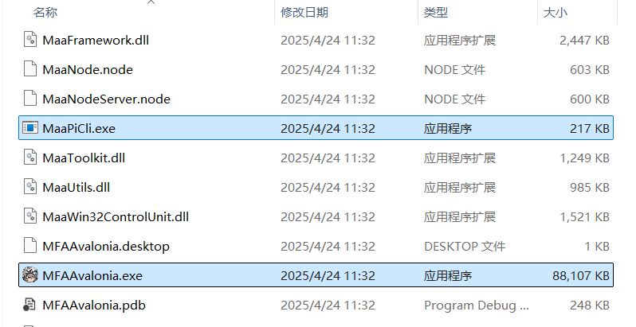

# 第一次启动

## 打开并配置模拟器

在解压文件后，首先不要着急打开 MNMA，请优先打开模拟器。

对于模拟器的支持情况，请参考 [模拟器和设备支持](https://maa.plus/docs/zh-cn/manual/device/)。

虽然 MaaFramework 框架支持大多数模拟器，但 MNMA 仍然**推荐使用 [mumu12](https://mumu.163.com/) 作为游戏载体。MNMA 在测试时使用 mumu12 官方版，使用其他模拟器环境遇到的问题开发组将不会被解决。**

在打开模拟器后，请在模拟器设置界面正确设置分辨率。**模拟器分辨率应为 `16:9` 比例（mumu12 的平板预设均为此比例），最低分辨率为 `1280x720`，不符合要求造成的运行报错将不会被解决。**

## 启动 MNMA

在配置好模拟器后，返回解压的文件夹，可以在文件夹内找到如下两个文件：

其中：

- `MaaPiCli.exe` 为控制台应用
- `MNMA.exe` 为 GUI 应用

如果您不是特别钟情于控制台应用，请直接双击运行 GUI。

::: details 为什么任务栏的图标是牛牛？
MNMA 使用 MFAAvalonia 作为 GUI。MFAAvalonia 是 MaaFw 系列的 GUI 开源项目，因为 MaaFw 最早是由方舟的 Maa 演化而来，因此 MFAAvalonia 的作者选择类似于 Maa 的牛牛图标作为 icon，也因此牛牛图标会被保留。
:::

::: tip
您可以右键 `MNMA.exe`，并依次选择`(->win11:显示更多选项)`->`发送到`->`桌面快捷方式`在桌面创建一个快捷方式，方便以后在桌面直接启动。
:::

如果在双击应用后弹出报错，请参考 [问题排查-程序运行类](../users/errors.md#程序运行类)

## 连接模拟器

在 MNMA 启动后，MNMA 需要连接模拟器，以获取模拟器 ADB 支持。

打开 MNMA 后，面板右侧日志将会提示目前的状态：

:::tip

如果模拟器连接失败，请参考[问题排查-模拟器连接失败](../users/errors.md#模拟器连接失败)

:::

## 加载 Agent

第一次启动 MNMA 时，Agent 将会调用程序自带的 Python 环境与 pip 下载 MNMA 运行所需的依赖库，因此等待时间可能较久。（但要是超过 5 分钟没动静那估计就是寄了）

待启动 Agent 完毕并没有出现报错后，系统会提示任务已全部完成，此时您可以开始使用 MNMA 了。

:::tip

如果 Agent 加载失败，请参考 [问题排查-Agent 加载失败](../users/errors.md#agent-加载失败)

:::

如果没问题，恭喜你已经可以愉快的使用 MNMA 了！接下来，您可以查看手册的 [功能说明](./funcs.md) 并尝试使用 MNMA 提供的功能，或自行探索。
