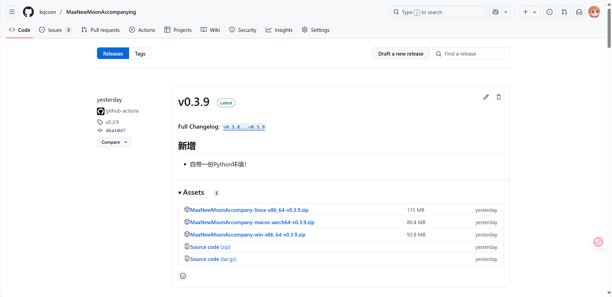
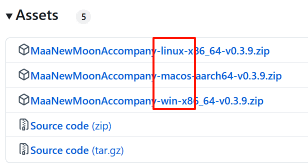

# 下载与安装

## 下载 MNMA 压缩包

您可以在 Github 上下载 MNMA 的任意 Release 版本。

首先，打开 [MNMA Github Release 页面](https://github.com/kqcoxn/MaaNewMoonAccompanying/releases)。

::: tip
如果 Github 页面打不开，请参考 [问题排查 - Github 页面打不开/下载缓慢](../users/errors.md#github-页面打不开-下载缓慢)
:::

一般，最上面的即为最新版。

下载适合自己系统的版本，目前 MNMA 支持 `Windows`、`Linux` 和 `MacOS` 系统，找到 `Assets` 列表中包含系统字段，点击链接即可下载。

::: tip
如果下载缓慢，请参考 [问题排查 - Github 页面打不开/下载缓慢](../users/errors.md#github-页面打不开-下载缓慢)
:::

注意事项：

- MNMA 在 **Windows 下仅支持 10 和 11**，旧版 Windows 请参阅 [MAA 常见问题](https://maa.plus/docs/zh-cn/manual/faq.html#%E7%B3%BB%E7%BB%9F%E9%97%AE%E9%A2%98) 中的系统问题部分。
- MNMA **暂不支持搭载 `Intel` 芯片的 MacBook**（包括双系统），`M`系列芯片建议进入交流群与群主说明后进行远程协助安装。
- MNMA 对于 Linux 的支持程度有限，仅打包可运行文件，如何运行与连接请自行探索。
- 若您希望操控 `Android` 实体设备，请前往[此页面](https://maa.plus/docs/zh-cn/manual/device/android.html)。 由于此方法涉及 adb 调试且仍需与电脑连接，不推荐使用此方法。

## \*Mirror 酱支持 <Badge type="tip" text="^0.3.5" />

在 [玛丽佬](https://github.com/MistEO)（方舟 MAA 开发者）的帮助下， MNMA 同样也接入了 [Mirror 酱](https://mirrorchyan.com/zh/projects) 的国内高速下载与更新服务，详情请见[【Bilibili】震惊！MAA 开启收费功能？！](https://www.bilibili.com/video/BV1cZFreLEja)

您可以通过 [此链接](https://mirrorchyan.com/zh/projects?rid=MNMA) 获取带有 Mirror 酱服务的 MNMA

## 解压 MNMA

确认解压完整，并**确保将 MNMA 解压到一个独立的文件夹中**。

注意：除关闭内建管理员批准的 `Administrator` 账号外，请勿将 MAA 解压到如 `C:\`、`C:\Program Files\` 等需要 UAC 权限的路径。（如果看不懂，反正能不往 C 盘放就别往 C 盘放）

如果您不了解如何解压压缩包，可以参考：[【Bilibili】电子扫盲课之如何解压藏在视频里的压缩包简易教程](https://www.bilibili.com/video/BV1tZ421N7EV)

::: danger 注意
无论如何，请不要在压缩软件直接打开程序！
:::

MNMA 为可直接运行程序，无须安装等操作，在解压后您可以查看下一节手册尝试运行。
